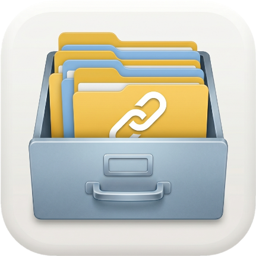

# LinkKeeper

<p align="center">
  
</p>

<p align="center">
  <b>ブラウザのブックマークを「自分のファイル」として手元に取り戻す macOS ユーティリティ</b>
</p>

<p align="center">
  <a href="#features">機能</a> ·
  <a href="#requirements">必要環境</a> ·
  <a href="#build--install">ビルド</a> ·
  <a href="#usage">使い方</a> ·
  <a href="concept.md">コンセプト</a> ·
  <a href="#license">ライセンス</a>
</p>

---

## なぜ作ったか

ブラウザのブックマーク機能は、かつてシンプルで信頼できるものだった。しかし今や、Safari のアップデートでサイドバーの挙動が変わり、Chrome のブックマークマネージャが突然 UI を刷新する。使い慣れた操作が消え、新しい操作を強制される。

**LinkKeeper はブックマーク管理をブラウザの外に取り戻す。** ブラウザから独立した macOS ネイティブアプリで、Finder のリスト表示に近い操作感を提供する。同期せず、連携せず、ローカルの JSON ファイルにすべてを保存する。

詳細は [concept.md](concept.md) を参照。

## Features

### コア機能

- **Finder ライクなリスト UI** — NSOutlineView ベース、階層表示・ドラッグ＆ドロップ・スローダブルクリックでのリネーム
- **D&D 中心のワークフロー** — Safari/任意ブラウザから URL をドラッグして追加、LinkKeeper から外部へドラッグアウトも可能
- **AppleScript ブラウザキャプチャ** — ワンクリックで最前面ブラウザの URL + ページタイトル + favicon を取得
  - Safari / Chrome / Edge / Brave / Arc / Vivaldi / Opera / **ChatGPT Atlas** に対応
  - ログインが必要なページでもタイトル取得可能
- **HTML spec 準拠の favicon 解決** — `<link rel="icon">` を解析し、サイズ大きい順に試行 → `/favicon.ico` → Google S2 favicon API
- **無限 Undo/Redo** — 削除・追加・移動・カラータグ変更・favicon 再取得すべてが Cmd+Z で取り消せる
- **完全な状態永続化** — ウィンドウサイズ・列幅・フォルダ開閉状態（見えていない下層含む）すべてが再起動後に復元される
- **アクセス・編集の全履歴記録** — 長期利用での「使われていないブックマーク」抽出を見据え、すべてのアクセス日時・編集日時を保持

### UI 機能

- **フローティングウィンドウ** — 全アプリより最前面に固定可能（Cmd+F）
- **カラーラベル** — Finder 互換の 7 色、メニューにカラードット付きで表示
- **Option+Click で再帰的展開/折りたたみ** — Finder と同じ挙動
- **コンテキストメニュー** — 任意のブラウザで開く、カラーラベル、編集、削除、フォルダ作成
- **編集ダイアログ (Cmd+I)** — タイトル・URL・カラー・favicon リロードを 1 画面で
- **クリップボードから作成 (Cmd+Shift+V)** — 長い URL も編集ダイアログで確認しながら登録

## Requirements

- macOS 13 (Ventura) 以降
- Xcode 16 以降
- [XcodeGen](https://github.com/yonaskolb/XcodeGen) （`brew install xcodegen`）

## Build & Install

```bash
# プロジェクト生成 + Release ビルド + /Applications にインストール
./gen_build_install.zsh --mac

# ビルドチェックのみ（インストールなし）
./gen_build_install.zsh --build-check
```

ビルドは必ずこのスクリプト経由で行う。`xcodebuild` を直接実行してはならない（CLAUDE.md 参照）。

## Usage

### 初回セットアップ

1. `./gen_build_install.zsh --mac` で `/Applications/LinkKeeper.app` にインストール
2. アプリを起動
3. メニュー **LinkKeeper > 設定…** （Cmd+,）から「よく使うブラウザ」を選択
4. 初回 AppleScript 実行時に macOS から自動化許可ダイアログが表示されるので許可

### 主な操作

| 操作 | 方法 |
|---|---|
| ブラウザからキャプチャ | ツールバーの **+** ボタンクリック |
| 別ブラウザから取得 | **+** の ▼ メニュー |
| URL ペーストで作成 | Cmd+Shift+V |
| 新規フォルダ | Cmd+N |
| リネーム | Enter または 選択行の再クリック（Finder 風） |
| 情報を見る/編集 | Cmd+I |
| 削除 | Delete または Backspace |
| 取り消す/やり直す | Cmd+Z / Cmd+Shift+Z |
| フローティング切替 | Cmd+F |
| 再帰的展開/折りたたみ | Option+Click（フォルダの ▶/▼ 上） |

### データ保存先

- ブックマーク: `~/Library/Application Support/LinkKeeper/bookmarks.json`
- ウィンドウ・列幅・フォルダ展開状態: macOS の UserDefaults

## Architecture

モノ指向（Object/Value-Oriented）設計。`refactoring-standard-swift.md` 準拠。

```
LinkKeeper/
├── App/         AppDelegate, main
├── Models/      BookmarkNode, BookmarkStore
├── Types/       Browser, BrowserCatalog, PageLookup, ColorTagMenu, ContextMenu, SymbolIcon
└── Views/       BookmarkList, BookmarkOutline, BookmarkCell, EditSheet, MainWindow, SettingsPanel
```

- 静的関数 (`static func`) を排除し、責務を値型 (`struct`) に移譲
- 型名は名詞のみ、2 単語以内
- 各型のメソッド数は 4〜5 個を目安

## License

[MIT License](LICENSE) © 2026 Shinya Ohtani
